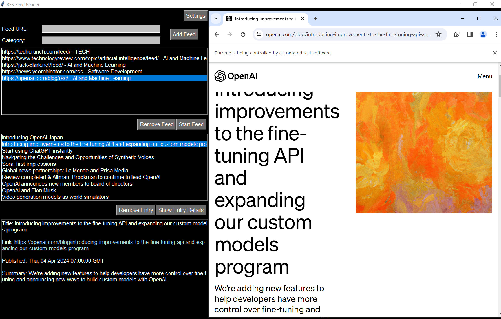

## RSSFeedReaderUI: Your Window to the World of Feeds

[](https://opensource.org/licenses/MIT)
[](https://www.python.org/)
[](#)
[](https://discord.gg/wBWPP6udpK)
[](https://www.instagram.com/digital_hallucinations/)

RSSFeedReaderUI is a user-friendly interface designed to enhance your RSS feed experience. It provides a centralized platform for managing, browsing, and reading content from your favorite RSS feeds, offering a seamless and customizable way to stay informed and engaged.



## Features

*   **Feed Management:** Easily add, remove, and organize your RSS feeds within the intuitive interface. Categorize feeds by topic or interest for efficient browsing.
*   **Feed Browsing:** Explore the latest content from your subscribed feeds with ease. Navigate through articles, preview summaries, and access full content with a single click.
*   **Reading Experience:** Enjoy a comfortable reading experience with customizable options. Adjust font sizes, choose between light or dark themes, and personalize the layout to suit your preferences.
*   **Offline Reading:** Access and read articles even when you're offline. RSSFeedReaderUI allows you to download content for later viewing, ensuring you never miss out on important updates.

## Dependencies

RSSFeedReaderUI relies on the following libraries:

*   feedparser
*   chardet
*   requests
*   logging
*   urllib.parse
*   os
*   asyncio
*   threading
*   tkinter
*   json
*   configparser
*   selenium

Please ensure you have these libraries installed before using RSSFeedReaderUI.

## Installation and Usage

1.  Clone the repository:

```
git clone https://github.com/DigitalHallucinations/RSSFeedReaderUI.git 
```

2.  Install the required dependencies:

```
pip install -r requirements.txt
```

3.  Run the application:

```
python main.py 
```

4.  Start adding your favorite RSS feeds and enjoy a streamlined reading experience!

## Contribution and Support

We welcome contributions from the community to enhance RSSFeedReaderUI further. If you'd like to get involved, please follow these guidelines:

*   Fork the repository and create a branch for your feature or bug fix.
*   Ensure your code adheres to the project's style guidelines.
*   Write unit tests to maintain code quality and stability.
*   Submit a pull request with a clear description of your changes.

For support or inquiries, please open an issue on the GitHub repository or reach out through [your preferred contact method].

## License

RSSFeedReaderUI is available under the MIT license. 

---

We're continuously working to improve RSSFeedReaderUI and add new features. Stay tuned for updates and let us know your feedback! 